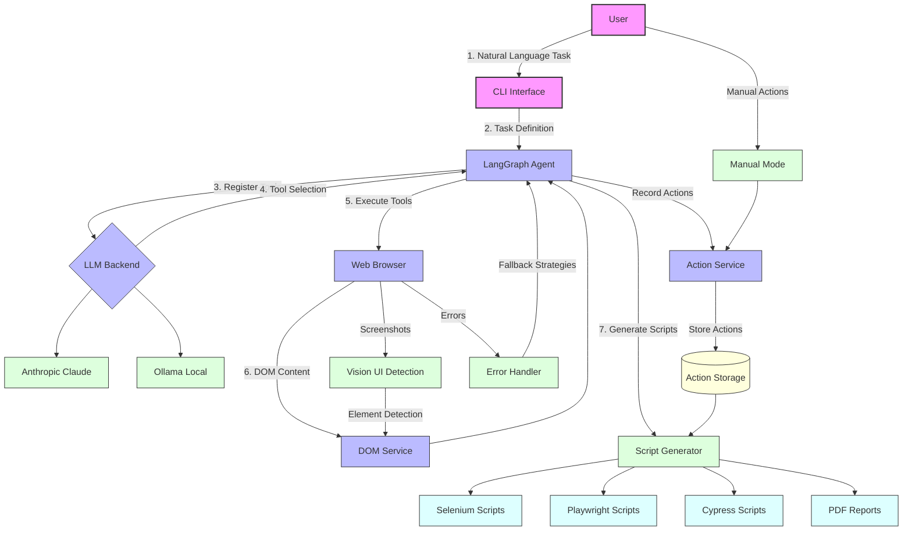

# Talk2Browser

A self-improving browser automation system powered by LLMs, Playwright, and modular agent services. Generate, record, and replay test scripts using natural language and advanced automation tools.

---

## 🚀 Features

- **Natural Language Browser Automation**: Control and test web apps using plain English.
- **Script Generation**: Generate Playwright, Cypress, and Selenium scripts from recorded actions.
- **Modular Tool Architecture**: Easily extend with new browser or script tools.
- **Vision Integration**: (Optional) YOLOv11-based UI element detection and metadata extraction.
- **Sensitive Data Handling**: Manage secrets securely via environment variables or `.env`.
- **LangGraph Workflows**: Flexible orchestration for complex browser tasks.
- **Extensible**: Add new tools, LLMs, or workflows as Python modules.

---

## 🛠️ Installation

1. **Python 3.10+ required.**
2. **Install Playwright browsers:**
   ```bash
   playwright install
   ```
3. **Install the package in development mode:**
   ```bash
   pip install -e .[dev]
   ```
4. **Copy and configure your environment variables:**
   ```bash
   cp .env.example .env
   # Edit .env and add your ANTHROPIC_API_KEY and other secrets
   ```

---

## 🎬 Playwright Script Generation

Automatically generate Playwright scripts from agent actions:

```python
import asyncio
from langchain_anthropic import ChatAnthropic
from talk2browser.agent.agent import BrowserAgent

async def main():
    # Initialize LLM
    llm = ChatAnthropic(model="claude-3-opus-20240229")
    
    # Run agent and generate script
    async with BrowserAgent(llm=llm, headless=False) as agent:
        # LLM-driven script generation: all steps and script output are requested in natural language
        script_path = await agent.run(
            "Navigate to example.com, search for 'Playwright', and generate a Playwright script for these actions."
        )
        print(f"Generated script: {script_path}")

asyncio.run(main())
```

### Standalone Script Generator

Convert recorded actions to a Playwright script:

```bash
python -m talk2browser.scripts.generate_playwright_script recorded_actions.json -o output_script.py
```

---

## ⚡ Quick Start

```python
import asyncio
from dotenv import load_dotenv
from talk2browser.agent import BrowserAgent

async def main():
    # Load environment variables
    load_dotenv()
    
    # Create and run the browser agent
    agent = BrowserAgent(headless=False)
    try:
        # All agent usage is LLM-driven: describe your test or automation task in natural language
        response = await agent.run("Go to example.com and take a screenshot")
        print("Agent response:", response)
    finally:
        # Clean up
        if hasattr(agent, 'graph'):
            del agent.graph

if __name__ == "__main__":
    asyncio.run(main())
```

---

## 🤖 How It Works

1. **Tool Registration**: Playwright's Page and ElementHandle methods are automatically registered as tools
2. **LLM Tool Selection**: The agent uses Claude 3 Opus to select the appropriate tool based on the user's request
3. **Tool Execution**: The selected tool is executed with the provided arguments
4. **Response Generation**: The agent generates a response based on the tool's output

### System Architecture



### Core Workflow

The simplified core workflow shows how natural language tasks are transformed into executable browser automation scripts:


> Note: The diagrams are rendered using Mermaid. If they don't display correctly in your markdown viewer, you can copy the Mermaid code and paste it into the [Mermaid Live Editor](https://mermaid.live/) to view and export as images.

---

## 📁 Project Structure

```
talk2browser/
├── src/
│   └── talk2browser/
│       ├── browser/       # Browser interaction and client
│       ├── tools/         # Tool registry and dynamic tool discovery
│       ├── agent/         # LangGraph agent implementation
│       └── utils/         # Utility functions and logging
├── examples/              # Example scripts
├── tests/                 # Test suite
├── .env.example           # Example environment variables
└── README.md              # This file
```

---

## 🤝 Contributing

1. Fork the repository
2. Create a feature branch (`git checkout -b feature/AmazingFeature`)
3. Commit your changes (`git commit -m 'Add some AmazingFeature'`)
4. Push to the branch (`git push origin feature/AmazingFeature`)
5. Open a Pull Request

---

## 📄 License

Distributed under the MIT License. See `LICENSE` for more information.

---

## 📧 Contact

Thusara Jayasinghe - thusaraj@gmail.com

Project Link: [https://github.com/thushara/talk2browser](https://github.com/thushara/talk2browser)
