# Talk2Browser

[](https://youtu.be/mOcW7bFahdk)
> Click the image to watch the full demo video on YouTube.


> Quick look: 5-second GIF demo generated from the video.

A self-improving browser automation system powered by LLMs, Playwright, and modular agent services. Generate, record, and replay test scripts using natural language and advanced automation tools.

---

## 🚀 Features

- **Natural Language Browser Automation**: Control and test web apps using plain English.
- **Script Generation**: Generate Playwright, Cypress, and Selenium scripts from recorded actions.
- **Modular Tool Architecture**: Easily extend with new browser or script tools.
- **Vision Integration**: (Optional) YOLOv11-based UI element detection and metadata extraction.
- **Sensitive Data Handling**: Manage secrets securely via environment variables or `.env`.
- **LangGraph Workflows**: Flexible orchestration for complex browser tasks.
- **Extensible**: Add new tools, LLMs, or workflows as Python modules.

---

## 🛠️ Installation

1. **Python 3.10+ required.**
2. **Install Playwright browsers:**
   ```bash
   playwright install
   ```
3. **Install the package in development mode:**
   ```bash
   pip install -e .[dev]
   ```
4. **Copy and configure your environment variables:**
   ```bash
   cp .env.example .env
   # Edit .env and add your ANTHROPIC_API_KEY and other secrets
   ```

---

## 🎬 Playwright Script Generation

Automatically generate Playwright scripts from agent actions:

```python
import asyncio
from langchain_anthropic import ChatAnthropic
from talk2browser.agent.agent import BrowserAgent

async def main():
    # Initialize LLM
    llm = ChatAnthropic(model="claude-3-opus-20240229")
    
    # Run agent and generate script
    async with BrowserAgent(llm=llm, headless=False) as agent:
        # LLM-driven script generation: all steps and script output are requested in natural language
        script_path = await agent.run(
            "Navigate to example.com, search for 'Playwright', and generate a Playwright script for these actions."
        )
        print(f"Generated script: {script_path}")

asyncio.run(main())
```

### Standalone Script Generator

Convert recorded actions to a Playwright script:

```bash
python -m talk2browser.scripts.generate_playwright_script recorded_actions.json -o output_script.py
```

---

## 🧑‍💻 Example: Run the BrowserAgent from CLI

You can run the BrowserAgent directly from the command line using the provided example script. This allows you to automate browser tasks and generate scripts using natural language instructions or pre-defined scenarios.

**Example usage:**

```bash
python examples/test_agent.py --task github_trending
```

This will:
- Launch the BrowserAgent
- Go to GitHub Trending
- Extract information about the top 10 trending repositories
- Generate a comprehensive PDF report
- Generate a Playwright Python script for the process

You can choose from a variety of tasks:

- `github_trending` (extract GitHub trending repos)
- `selenium`, `cypress`, `playwright`, `playwright_ts` (automation script generation)
- `filedata` (uses test data from file)
- `tiktok_trending`, `amazon_bose`, `gumtree_dogs` (real-world web automation examples)

See the `examples/test_agent.py` file for full details and how to add your own tasks.

---

## ⚡ Quick Start

Here's a more realistic example using the BrowserAgent to automate a real-world scenario, similar to the CLI examples:

```python
import asyncio
import os
from dotenv import load_dotenv
from talk2browser.agent import BrowserAgent

async def main():
    # Load environment variables
    load_dotenv()
    
    # Prepare a test scenario (e.g., GitHub Trending extraction)
    task = (
        "Go to https://github.com/trending. "
        "Extract information about the top 10 trending repositories including: "
        "- Repository name\n- Owner/organization\n- Description\n- Primary programming language\n- Number of stars\n- Number of forks\n- URL to the repository. "
        "Create a comprehensive PDF report with all the extracted information, formatted in a clean and readable way. "
        "Finally generate a Playwright python script that automates this entire process."
    )
    
    # Optionally, inject sensitive data if needed
    sensitive_data = {
        "company_username": os.getenv("COMPANY_USERNAME", "standard_user"),
        "company_password": os.getenv("COMPANY_PASSWORD", "secret_sauce")
    }
    
    async with BrowserAgent(headless=False) as agent:
        response = await agent.run(task, sensitive_data=sensitive_data)
        print("Agent response:", response)

if __name__ == "__main__":
    asyncio.run(main())
```

This example will launch the BrowserAgent, navigate to GitHub Trending, extract repository data, generate a PDF report, and produce a Playwright script for the workflow—all driven by natural language.

---

## 🤖 How It Works

1. **Tool Registration**: Playwright's Page and ElementHandle methods are automatically registered as tools
2. **LLM Tool Selection**: The agent uses Claude 3 Opus to select the appropriate tool based on the user's request
3. **Tool Execution**: The selected tool is executed with the provided arguments
4. **Response Generation**: The agent generates a response based on the tool's output

### System Architecture

```mermaid
flowchart TB
    %% Core Flow - Simplified
    User[👤 User] --> |"Natural Language Task"| CLI[🖥️ CLI Interface]
    CLI --> Agent[🤖 AI Agent]
    
    %% AI Processing
    Agent --> |"Analyze Task"| LLM[🧠 LLM Engine]
    LLM --> |"Plan Actions"| Agent
    
    %% Browser Interaction
    Agent --> |"Execute Actions"| Browser[🌐 Browser]
    Browser --> |"Capture Actions"| Recorder[📝 Action Recorder]
    
    %% Script Generation
    Recorder --> |"Action Sequence"| Generator[⚡ Script Generator]
    Generator --> Scripts[📄 Clean Scripts]
    
    %% Output Options
    Scripts --> Selenium[🔧 Selenium]
    Scripts --> Playwright[🎭 Playwright]
    Scripts --> Cypress[🌲 Cypress]
    
    %% Backend Support
    LLM -.-> Claude[Anthropic Claude]
    
    %% Enhanced Features (Secondary)
    Browser -.-> Vision[👁️ Vision Detection]
    Vision -.-> Recorder
    
    %% Clean Styling
    classDef primary fill:#2563eb,stroke:#1e40af,stroke-width:2px,color:#fff
    classDef secondary fill:#059669,stroke:#047857,stroke-width:2px,color:#fff
    classDef tertiary fill:#7c3aed,stroke:#6d28d9,stroke-width:2px,color:#fff
    classDef output fill:#dc2626,stroke:#b91c1c,stroke-width:2px,color:#fff
    classDef support fill:#6b7280,stroke:#4b5563,stroke-width:1px,color:#fff
    
    class User,CLI primary
    class Agent,LLM,Generator secondary
    class Browser,Recorder tertiary
    class Scripts,Selenium,Playwright,Cypress output
    class Claude,Vision support
```



### Core Workflow

> Note: The diagrams are rendered using Mermaid. If they don't display correctly in your markdown viewer, you can copy the Mermaid code and paste it into the [Mermaid Live Editor](https://mermaid.live/) to view and export as images.

---

## 📁 Project Structure

```
talk2browser/
├── src/
│   └── talk2browser/
│       ├── browser/       # Browser interaction and client
│       ├── tools/         # Tool registry and dynamic tool discovery
│       ├── agent/         # LangGraph agent implementation
│       └── utils/         # Utility functions and logging
├── examples/              # Example scripts
├── tests/                 # Test suite
├── .env.example           # Example environment variables
└── README.md              # This file
```

---

## 🤝 Contributing

1. Fork the repository
2. Create a feature branch (`git checkout -b feature/AmazingFeature`)
3. Commit your changes (`git commit -m 'Add some AmazingFeature'`)
4. Push to the branch (`git push origin feature/AmazingFeature`)
5. Open a Pull Request

---

## 📄 License

Distributed under the MIT License. See `LICENSE` for more information.

---

## 📧 Contact

Thusara Jayasinghe 

Project Link: [https://github.com/talk2silicon/talk2browser](https://github.com/talk2silicon/talk2browser)
